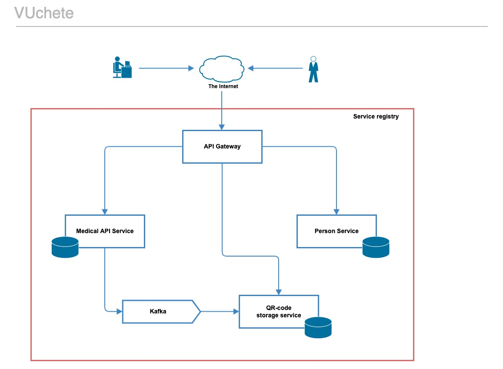

## Technologies:
:small_blue_diamond: Java 11  
:small_blue_diamond: Spring Boot  
:small_blue_diamond: Spring Cloud (OpenFeign, Eureka)  
:small_blue_diamond: Spring Data  
:small_blue_diamond: Kafka  
:small_blue_diamond: Docker  
:small_blue_diamond: PostgreSQL  
:small_blue_diamond: Maven  

## Description  
This demo web application provides REST API to collect information about persons, vaccinations, generate and store QR-codes.
Consist of 6 microservices:  
:heavy_check_mark: [Person API](person-api/) - to work with personal information about vaccinated people.    
:heavy_check_mark: [Medical API](medical-api/) - to work with information about vaccinations  
:heavy_check_mark: [QR service](qr-service/) - to work with QR-codes  
:heavy_check_mark: [API gateway](api-gateway/) - application entry point, requests router  
:heavy_check_mark: [Service registry](service-registry/) - microservices monitoring  
  
  
  
Microservices interact with each other by feign clients.

## build & run
1) docker-compose build
2) docker-compose up
